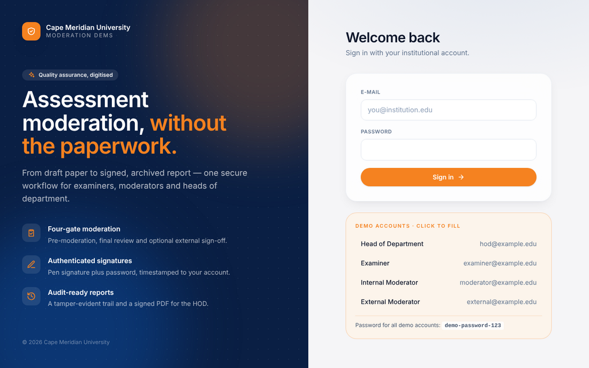
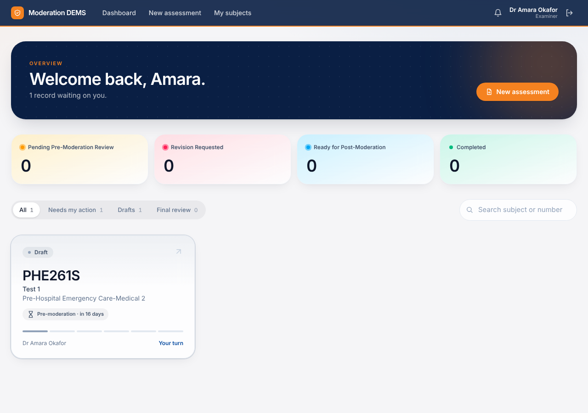
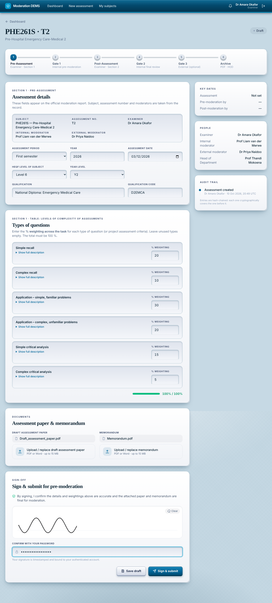
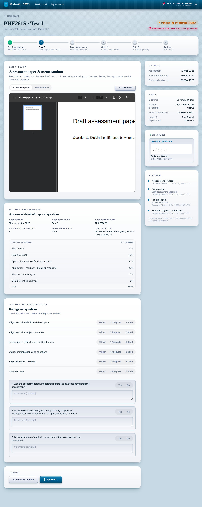
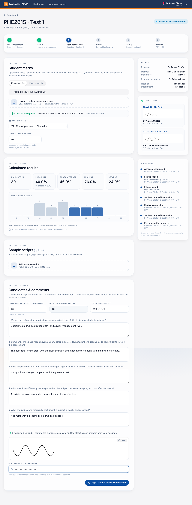
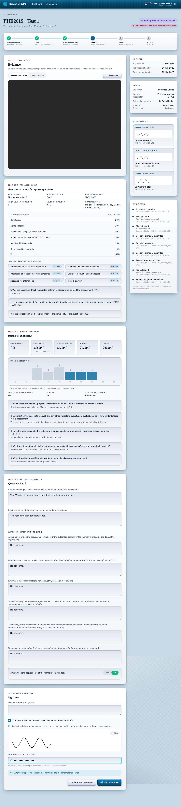
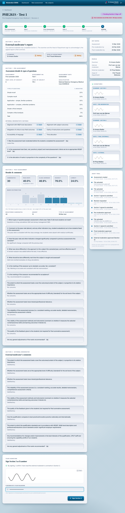
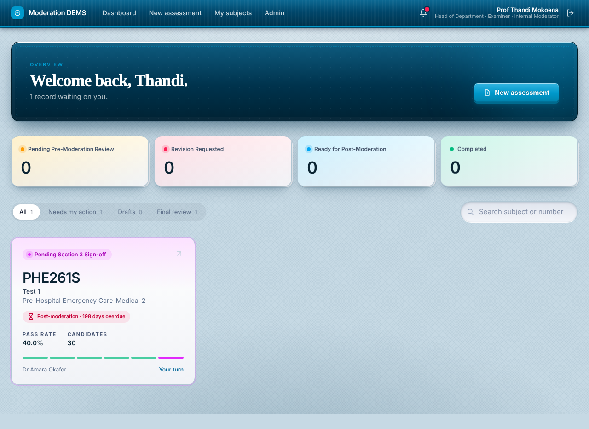
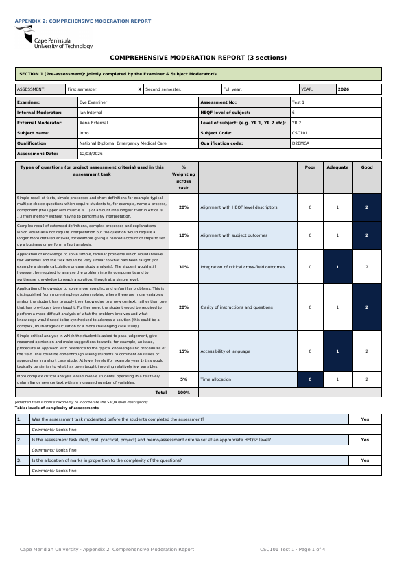
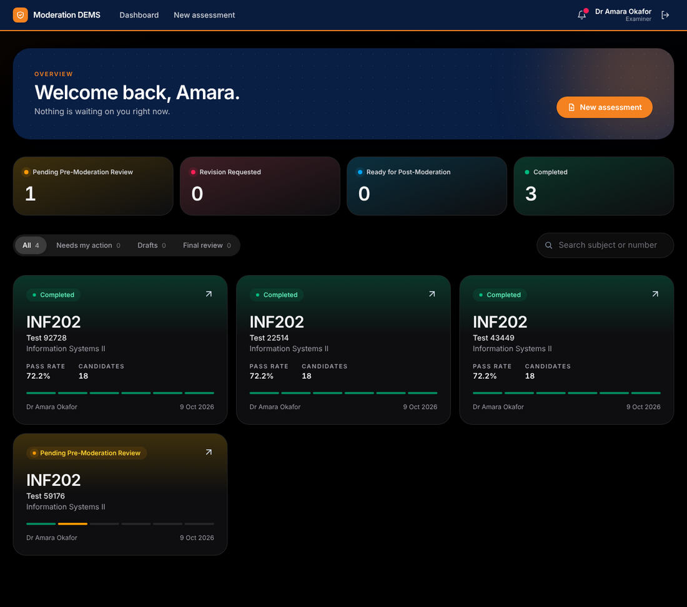

# Moderation DEMS

[](https://github.com/meyerjo2024/ModerationDEMS/actions/workflows/ci.yml)

**Academic Digital Examination & Moderation System** — replaces the manual, document-centric moderation cycle with a role-based, audited, web-hosted workflow that ends in a signed PDF report for the Head of Department.

**Stack:** Laravel 13 (PHP 8.3) · Blade + Alpine.js · Tailwind CSS 4 · PostgreSQL (Supabase) · PhpSpreadsheet · Dompdf — develops on **Laravel Herd**, deploys as a Docker service on **Render**.



## Screenshots

| | |
|---|---|
|  **Dashboard** — status tiles, filters and wallet-style cards |  **Phase 1** — question types, documents, signature |
|  **Gate 1** — document viewer and decision |  **Phase 3** — marks to automatic statistics |
|  **Gate 2/3** — quality checks and signature |  **Completed** — archived record and PDF |
|  **Section 3 sign-off** — examiner and HOD |  **One person, several roles** (HOD who also examines/moderates) |
|  **Signed PDF report** ([sample](docs/sample-report.pdf)) |  **Dark mode** (and fully responsive) |

## Workflow

| # | Phase / Gate | Actor | Status after |
|---|---|---|---|
| 1 | Pre-assessment: Section 1 details and question-type weightings, paper + memo, signature | Examiner | `Pending Pre-Moderation Review` |
| 2 | **Gate 1** pre-moderation: rate each criterion 0/1/2, answer Section 1 Q1–3, consensus + signature, or request revision | Internal moderator | `Ready for Post-Moderation` / `Revision Requested` |
| 3 | Post-assessment: class-list marks → automatic statistics, registered/absent, Section 2 Q1–5, signature | Examiner | `Pending Final Moderation Review` |
| 4 | **Gate 2** final review: Section 2 Q6–8, comments, mark adjustments, signature | Internal moderator | `Completed`, or `Pending External Moderation` if an external moderator is assigned |
| 4b | **Gate 3** external review (optional): completes Section 3 | External moderator | `Pending Section 3 Sign-off` |
| 4c | Section 3 sign-off (only when an external moderator is assigned) | Examiner + HOD | `Completed` |
| 5 | PDF in the layout of the official CPUT *Appendix 2: Comprehensive Moderation Report* generated and archived; HOD notified | System | `Completed` |

Gate numbering: Gate 1 = internal pre-approval, Gate 2 = internal final consensus, Gate 3 = optional external moderator. The HOD receives the report and can monitor every record in their subjects; they are not a signing gate. Diagrams and the permission matrix: **[docs/workflow.md](docs/workflow.md)**.

## Documentation

| | |
|---|---|
| 📘 **User manuals** | [Getting started](docs/manuals/00-getting-started.md) · [Examiner](docs/manuals/01-examiner.md) · [Internal moderator](docs/manuals/02-internal-moderator.md) · [External moderator](docs/manuals/03-external-moderator.md) · [HOD & admin](docs/manuals/04-head-of-department.md) |
| 🔄 **Workflow reference** | [docs/workflow.md](docs/workflow.md) — state machine, sequence, roles, calculations, signatures, audit |
| 🚀 **Deployment** | [docs/deployment.md](docs/deployment.md) — Herd, Supabase, Render, troubleshooting |
| 🛠 **Development** | [docs/development.md](docs/development.md) — structure, tests, GitHub Actions |

## Quick start (Laravel Herd)

```bash
cp .env.example .env
composer install
npm install && npm run build
php artisan key:generate
# set DEMS_SEED_PASSWORD (10+ chars) and DEMS_DEMO_DATA=true in .env, point DB_* at Postgres, then:
php artisan migrate
php artisan db:seed
```

Open `http://moderation-dems.test`. With demo data the login page lists `hod@`, `examiner@`, `moderator@` and `external@example.edu` — click one to fill it in. Full steps: [deployment guide](docs/deployment.md).

## Deploy (Render + Supabase, free)

1. Supabase project → copy the **Session pooler** URI (port 5432) → this is `DB_URL`.
2. Render → **Web Service** (or Blueprint) → **Docker**, **Free** → paste the variables from [`.env.render.example`](.env.render.example).
3. Every start runs the migrations and seeds the first HOD. Check `/health`, then sign in.

Troubleshooting table (wrong branch, payment prompt, password errors, Supabase circuit breaker, …): [docs/deployment.md](docs/deployment.md#troubleshooting-problems-seen-in-real-deployments).

## Security & audit model

- Roles `EXAMINER`, `INTERNAL_MODERATOR`, `EXTERNAL_MODERATOR`, `HOD`. Routes are role-gated **and** every action checks the user's assignment on that record; records a user may not see return 404.
- **Signatures = pen drawing + password re-entry**, stored with a SHA-256 hash of what was attested, timestamp, IP and browser.
- Row-locked state machine: a record cannot be advanced twice.
- Statistics are **recomputed server-side** from the source marks; the browser never supplies them.
- Word (`.docx`) papers and memoranda are reviewed **in the browser**: moderators highlight passages and comment; the comments return to the examiner with the revision request. (Older `.doc` files are download-only.)
- Hash-chained, append-only audit log per record (tamper-evident; the PDF shows the chain head).
- Student marks are stored as anonymous numbers; the raw workbook is downloadable by the examiner only; external moderators see a record only once it reaches them.
- CSRF on every mutation, login and signing throttles, upload validation by extension **and** magic bytes, Row Level Security enabled for Supabase.

## Calculation rules

Marks are read from the class-list marksheet (`.xls`) — see [workflow](docs/workflow.md#what-the-system-calculates). Candidates = non-blank numeric rows · Pass = mark ≥ 50 % of total marks · highest / lowest / class average as % · non-numeric entries (e.g. `ABS`) are excluded and reported, never silently counted. Details in [docs/workflow.md](docs/workflow.md#what-the-system-calculates).

## Tests & CI

```bash
php artisan test        # SQLite in memory; add DB_CONNECTION=pgsql … for PostgreSQL
```

GitHub Actions ([`ci.yml`](.github/workflows/ci.yml)) builds assets and runs the suite on SQLite **and** PostgreSQL for every push and pull request.

## Known limits

- The Docker/Render setup was written and the app tested outside Docker; deployment issues are collected in the troubleshooting table.
- PDF preview is inline for PDFs; Word files are download-only.
- Marks upload reads the university **class-list marksheet** (`.xls`) as exported, and plain `.xlsx` / `.csv` with headings in row 1.
- No self-service password reset yet; administrators set passwords.
- E-mail is optional and only active when a real `MAIL_MAILER` is configured; otherwise the PDF is downloaded from the record.
- Login throttling uses the cache (`file` by default); use a shared store if you run several instances.

## Repository

Original proposal: [`docs/Academic Moderation System Proposal (Generic)_RM.docx`](docs/Academic%20Moderation%20System%20Proposal%20%28Generic%29_RM.docx).
