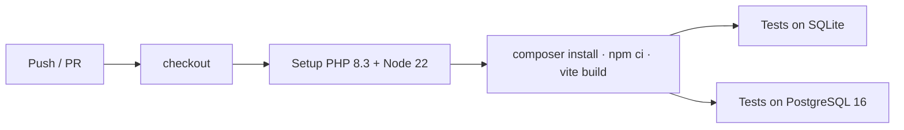

# Development guide

## Stack

| Layer | Choice |
|---|---|
| Framework | Laravel 13, PHP 8.3 |
| UI | Blade views, Alpine.js, Tailwind CSS 4 (Vite) |
| Database | PostgreSQL (SQLite in memory for fast tests) |
| Excel | PhpSpreadsheet (`.xlsx`, `.csv`) |
| PDF | Dompdf (vector text, embedded signatures) |

## Layout

```
app/
  Enums/            Role, AssessmentStatus (labels, colours, next step), SignatureSection, …
  Models/           Assessment (visibility rules), Attachment, Signature, AuditLog, …
  Http/Controllers/ thin controllers; WorkflowController = JSON endpoints behind the screens
  Http/Middleware/  EnsureRole (route-level RBAC), SecurityHeaders
  Services/
    Workflow.php            the state machine — every transition lives here
    StatisticsCalculator.php  pass rate, average, distribution
    WorkbookReader.php      sheets/columns from the marks workbook
    Signer.php              pen image + password confirmation
    Audit.php / Hashing.php hash-chained audit log
    ReportService.php       PDF data + rendering
    FileStore.php           db / disk storage
config/dems.php     institution, gates, quality-check questions, audit labels
resources/views/    components (x-…), panels per workflow step, pdf/report.blade.php
resources/js/app.js Alpine components: signature pad, forms, notifications
database/migrations tables + Row Level Security
docker/             start-up scripts (DB check, seed)
tests/              unit (calculator) + feature (full lifecycle, access control)
```

## Run tests

```bash
php artisan test                                   # SQLite in memory
DB_CONNECTION=pgsql DB_HOST=127.0.0.1 DB_DATABASE=dems_test \
DB_USERNAME=root DB_PASSWORD= php artisan test     # PostgreSQL
vendor/bin/pint                                    # code style
```

The feature tests drive the real HTTP endpoints through the whole lifecycle (with and without an external moderator), including wrong passwords, double submits, permission checks, the audit-chain tamper check and PDF generation.

## GitHub Actions

`.github/workflows/ci.yml` runs on every push and pull request:

1. Installs PHP 8.3 (with `gd`, `zip`, `pdo_pgsql`) and Node 22.
2. `composer install`, `npm ci && npm run build`.
3. Runs the full test suite **twice** — on SQLite and on a PostgreSQL 16 service container.



Deployments are done by Render, which rebuilds the Docker image when the linked branch changes (`autoDeploy`).

## Changing the workflow

- **Statuses and actors:** `app/Enums/AssessmentStatus.php`.
- **Rules per step:** `app/Services/Workflow.php` (add a test in `tests/Feature/LifecycleTest.php`).
- **Quality-check questions:** `config/dems.php` → `quality_checks`.
- **Look and feel:** colours and component classes in `resources/css/app.css` (`--color-brand`, `--color-navy`, `--color-accent`).
- **Report layout:** `resources/views/pdf/report.blade.php`.

## Regenerating the screenshots

The images in `docs/screenshots` were captured from a seeded demo database with Playwright driving a real browser through the whole lifecycle (including drawing the signatures). Re-run that script after UI changes and replace the files.
