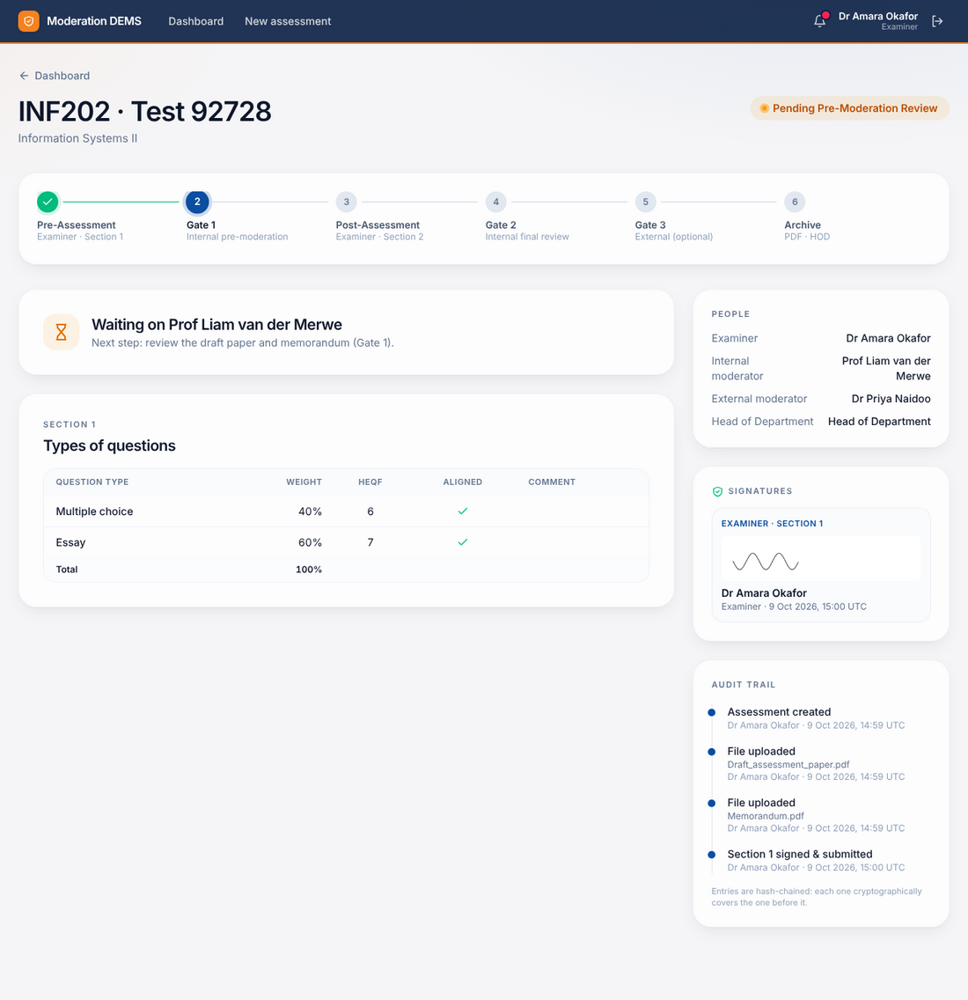
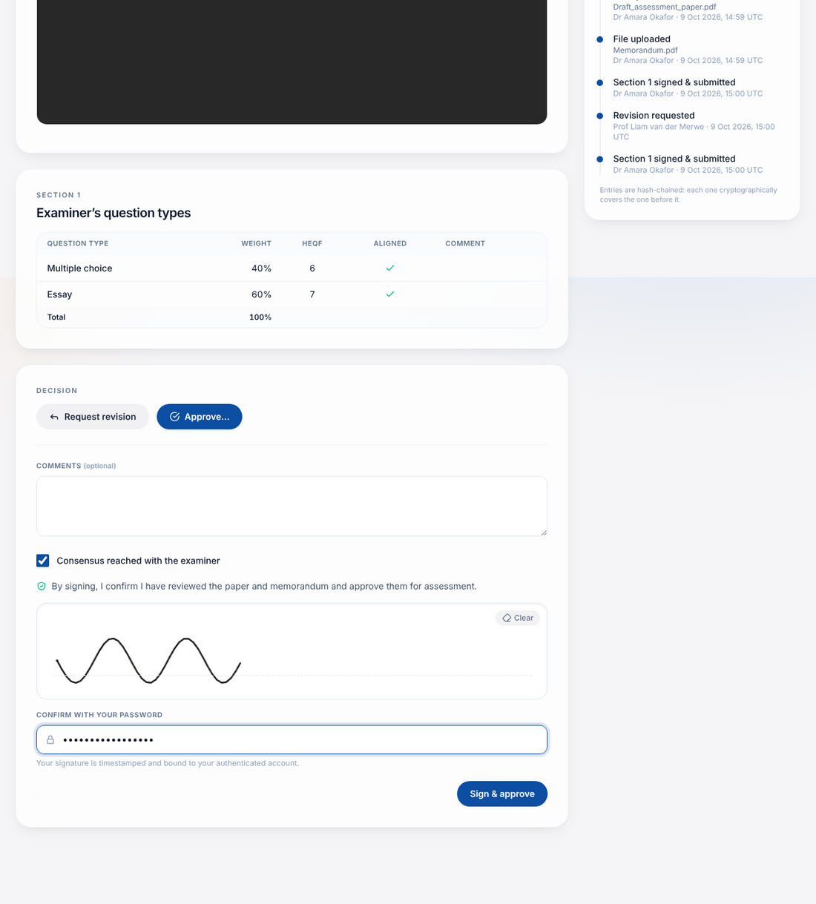
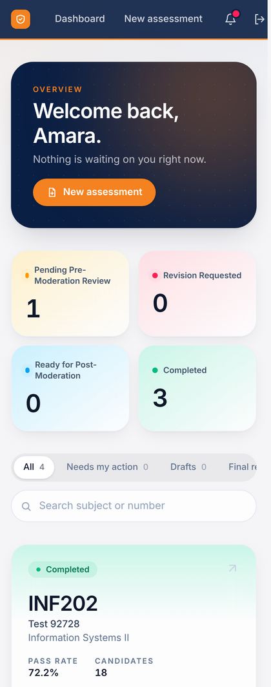

# Getting started

Moderation DEMS replaces the paper-and-e-mail moderation cycle with one guided workflow. Everyone signs in at the same address and sees only what applies to them.

## 1. Sign in

- Use your institutional e-mail and password. Accounts are created by your Head of Department (see [HOD manual](04-head-of-department.md)).
- After 8 failed attempts you are asked to wait a few minutes.
- **Demo installations** show a box with ready-made accounts — click one to fill in the form.

## 2. Your dashboard

| Area | Meaning |
|---|---|
| **Welcome banner** | How many records are waiting on *you* |
| **Status tiles** | Counts for *Pending Pre-Moderation*, *Revision Requested*, *Ready for Post-Moderation* and *Completed*; click one to filter |
| **Tabs and search** | *All*, *Needs my action*, *Drafts*, *Final review*; search by subject code or assessment number |
| **Cards** | One per assessment. A **"Your turn"** badge and coloured outline mean it is waiting for you. The six segments show progress through the gates |
| **Bell icon** | Notifications when something is handed to you |

Dark mode follows your device setting.

## 3. The record page

Click a card to open the record.

1. **Header** – subject, assessment, current status.
2. **Journey bar** – Pre-Assessment → Gate 1 → Post-Assessment → Gate 2 → Gate 3 (if assigned) → Archive.
3. **Main panel** – the form or review screen for *your* step, or a "Waiting on …" message when it is someone else's turn.
4. **Sidebar** – the people involved, collected signatures and the **audit trail** (who did what, when).

## 4. Signing

Every sign-off asks for two things:

1. **Draw your signature** in the pad (mouse, finger or Apple Pencil). *Clear* starts over.
2. **Enter your password.** This confirms it is really you.

The signature is stamped with the time, your account and what you attested to. It cannot be edited later.

## 5. Phones and tablets

The app is responsive; every screen works on a phone.

## Which manual do I need?

| Your role | Read |
|---|---|
| Examiner | [Examiner manual](01-examiner.md) |
| Internal moderator | [Internal moderator manual](02-internal-moderator.md) |
| External moderator | [External moderator manual](03-external-moderator.md) |
| Head of Department | [HOD & administrator manual](04-head-of-department.md) |

See also: [workflow reference](../workflow.md).
