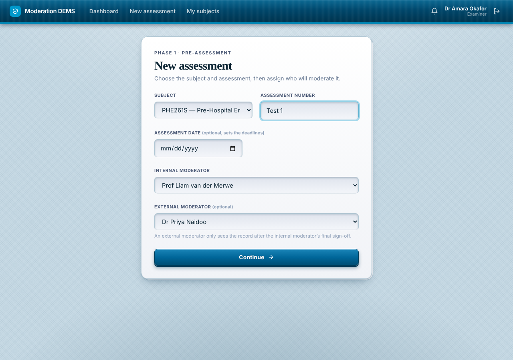
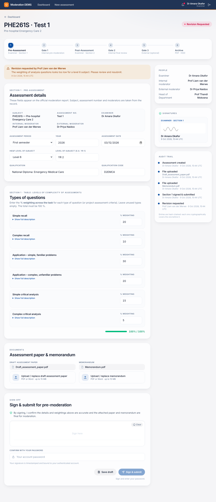
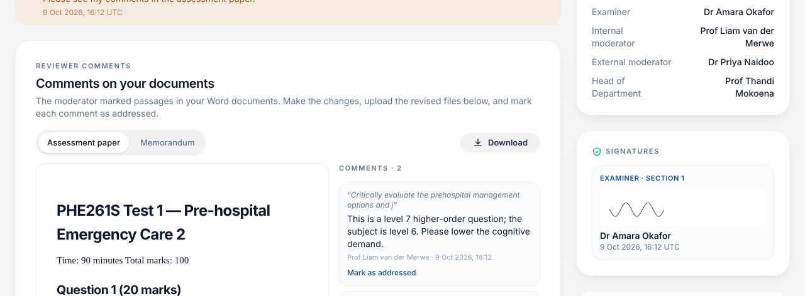

# Examiner manual

You own an assessment from the first draft to the final signed report. You act in **three places**: starting the assessment and Section 1 (Phase 1), fixing feedback, and recording results (Phase 3).

## A. Start a new assessment

1. Click **New assessment** (header or dashboard banner).

2. Choose the **subject code** and type the **assessment number** (e.g. `Test 1`, `Exam`).
3. Pick the **internal moderator**. Optionally pick an **external moderator** — they only see the record after the internal moderator has signed off.
4. Click **Continue**.

> You cannot choose yourself as a moderator, and a subject cannot have two assessments with the same number.

## B. Phase 1 — Section 1 (before the assessment)

1. **Types of questions.** For each type (Multiple choice, Essay, …) enter the **weighting %**, the **HEQF level** (5–10) and whether it is **aligned** with the level descriptor; add an optional comment. Use **Add question type** for more rows. The bar must reach **100 %**.
2. **Documents.** Upload the **draft assessment paper** and the **memorandum** (PDF or Word, up to 15 MB each). You can replace a file at any time before submitting.
3. **Sign.** Draw your signature, enter your password.
4. Click **Sign & submit**. Use **Save draft** to keep your work without submitting.

The button stays disabled until the weightings total 100 %, both documents are attached and you have signed (the hint under the button says what is missing).

Status becomes **Pending Pre-Moderation Review** and the internal moderator is notified.

## C. If a revision is requested

The record returns to **Revision Requested** with the moderator's feedback at the top. Make the changes (edit rows, replace the paper or memo), sign again and resubmit. This can repeat as often as needed; the revision number shows in the header.

## D. Phase 3 — Section 2 (after marking)

When the moderator approves, the status is **Ready for Post-Moderation**. Once the assessment has been written and marked, open the record again.

**Step 1 – Student marks**
- **Marksheet file (the university class list):** upload the exported class-list marksheet **as it comes out of the system** (`.xls`; `.xlsx` and `.csv` also work). The app finds the heading row by itself and shows **"Class list recognised"** with the subject code, year, lecturer and number of students listed.
- Choose the **test** (`T1`, `T2`, …). Only the test columns are offered, each with its **weight** (e.g. *T1 · 20% of year mark · 30 marks*); tests that have not been captured yet are greyed out ("no marks yet"). If your assessment is called *Test 1*, *T1* is selected for you.
- **Enter manually:** switch the tab and type one mark per line.
- **Total marks available:** 100 for a class list (its marks are already percentages).

The app checks the file against your assessment and warns you (without blocking) if the class list belongs to a different subject code, or if some listed students have **no mark** in the chosen test (absent / not captured) — those students are not counted as candidates. An anonymised example is in [`docs/samples/PHE261S_class-list_SAMPLE.xls`](../samples/PHE261S_class-list_SAMPLE.xls).

**Step 2 – Calculated results** appear automatically: candidates, pass rate (≥ 50 %), class average, highest and lowest mark, plus a distribution chart. Entries that cannot be used (such as `ABS`) are listed as excluded. Check these look right before continuing.

**Step 3 – Sample scripts (optional).** Attach marked scripts (PDF, PNG, JPG) — ideally a high, an average and a low one.

**Step 4 – Registered/absent numbers, Section 2 Q1–5 and signature.** Confirm registered students (absent is calculated), the type of assessment, and answer the form's five questions on how students fared, then sign and click **Sign & submit for final moderation**.

> The numbers you see are a preview. When you sign, the system **recalculates them from your file**, so what the moderator sees is always consistent with your upload.
> The workbook itself is only visible to you. Moderators see the statistics and your sample scripts, not student numbers.

## E. If the record is returned

If the moderator requests a revision at Gate 1, your Word documents appear with the moderator's highlighted comments. Make the changes, upload the revised files, and mark each comment as **addressed**.

A moderator can send the results back with feedback. The record returns to **Ready for Post-Moderation**; correct the marks or commentary and submit again. Moderators sign again afterwards.

## F. After completion

When all signatures are in, the record shows **Moderation complete** and you can download the signed PDF.

## Tips

- Check the **Audit trail** in the sidebar if you are unsure what happened last.
- Don't edit the exported class list (no extra header rows or merged cells); the app reads it as exported.
- Marks as percentages (`62%`) or with a decimal comma (`45,5`) are understood.
- If a button is greyed out, look for the grey hint under it.
