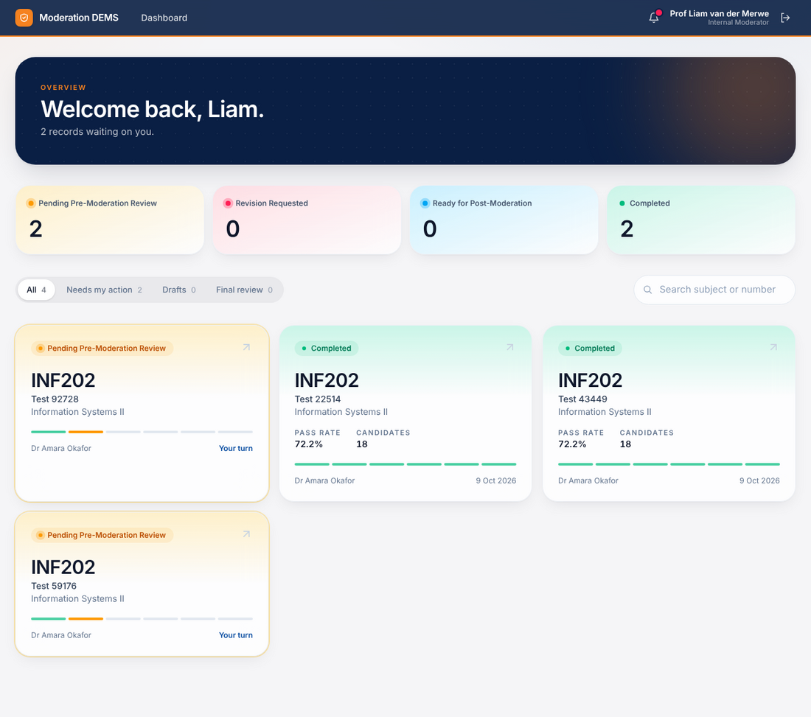
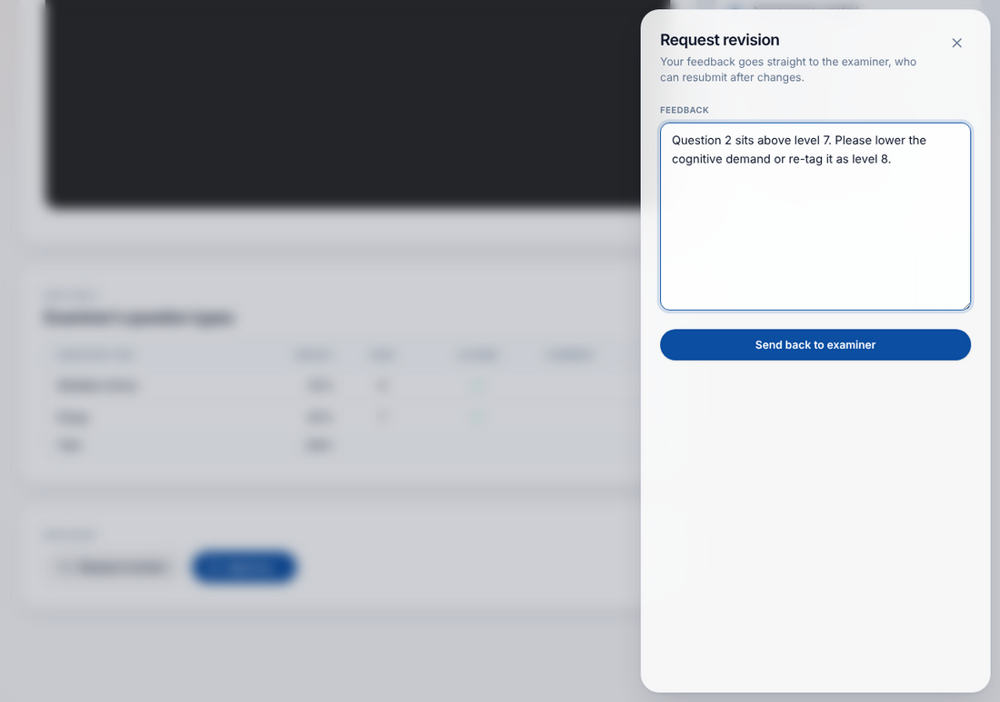
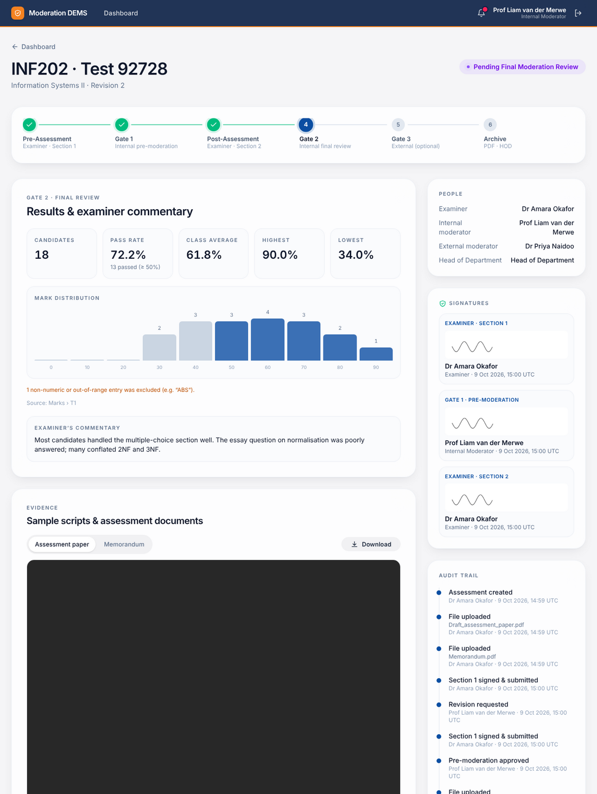

# Internal moderator manual

You are involved twice for every assessment you are assigned: **Gate 1** (before the assessment) and **Gate 2** (after marking).

## Find your work

Cards with **"Your turn"** are waiting for you. The bell shows new hand-overs. Open a card to start.

## Gate 1 — Pre-moderation review

1. **Read the documents.** The viewer has tabs for the **assessment paper** and the **memorandum**. PDFs open inside the page; Word files are offered as a download. *Download* is available for both.
2. **Check Section 1.** The table shows the examiner's question types, weightings, HEQF levels and alignment.
3. **Decide:**

### Request revision
Click **Request revision**, write specific feedback (at least a few words) and send it. The examiner is notified and the status becomes **Revision Requested**.

### Approve
1. Click **Approve…**.
2. Optionally add comments.
3. Tick **Consensus reached with the examiner**.
4. Sign (drawing + password) and click **Sign & approve**.

The status becomes **Ready for Post-Moderation**.

## Gate 2 — Final moderation

After the examiner submits results you are notified again.

1. **Review the results.** Statistics, distribution and the examiner's commentary are at the top.
2. **Review the evidence.** Open sample scripts (tabs *Script 1, 2, …*) and, if needed, the paper and memorandum.
3. **Complete the quality check.** Answer every question **Yes / No / N/A**:

   1. Marking is accurate and in line with the memorandum
   2. Marks have been totalled and transcribed correctly
   3. Marking was fair and free from bias
   4. Marking was applied consistently across the sample
   5. Valid alternative answers were credited
   6. Outcomes align with the learning outcomes and HEQF level
   7. The pass rate and distribution are reasonable
   8. The examiner's commentary is accurate and sufficient

   A **No** requires an explanation.
4. Enter **Scripts sampled**, optional comments, tick **Consensus reached**, sign and click **Sign & approve**.

**What happens next**
- If an **external moderator** is assigned, the record goes to them (**Pending External Moderation**).
- Otherwise the moderation is **Completed**: the PDF report is created and archived immediately.

### Return to examiner
If something needs correcting, click **Return to examiner**, give feedback and send. The examiner fixes Section 2 and resubmits; you then review again.

## Good to know

- Everything you open (paper, memorandum, scripts) is logged in the audit trail as *viewed* — this is the evidence that you reviewed it.
- You cannot see the raw marks workbook, only the statistics.
- You can only act on records assigned to you; you cannot moderate your own assessments.
