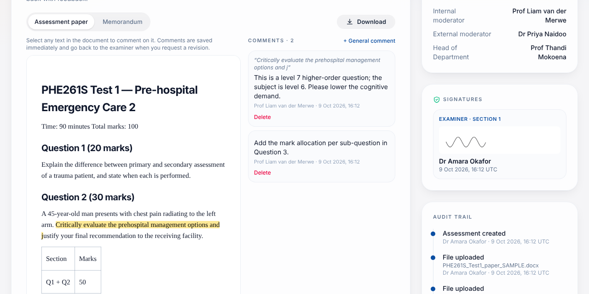

# Internal moderator manual

You are involved twice for every assessment you are assigned: **Gate 1** (before the assessment) and **Gate 2** (after marking).

## Before you start: choose your subjects

Open **My subjects** and tick the subjects you moderate. Examiners are then offered you when they create an assessment for those subjects. Pre-moderation is due 14 days before the assessment date and post-moderation 14 days after it; you are reminded in the app when a deadline is close or missed.

## Find your work

Cards with **"Your turn"** are waiting for you. The bell shows new hand-overs. Open a card to start.

## Before you start: choose your subjects

Open **My subjects** and tick the subjects you moderate. Examiners are then offered you when they create an assessment for those subjects. Pre-moderation is due 14 days before the assessment date and post-moderation 14 days after it; you are reminded in the app when a deadline is close or missed.

## Gate 1 — Pre-moderation review

1. **Read and comment on the documents.** Word (`.docx`) papers and memoranda open **in the browser**: select any passage and write a comment (or use *+ General comment*). Comments are saved immediately, highlighted in yellow, and listed beside the document; you can delete your own. When you **Request revision** they go back to the examiner together with your feedback.

   Viewer: The viewer has tabs for the **assessment paper** and the **memorandum**. PDFs open inside the page; Word files are offered as a download. *Download* is available for both.
2. **Check Section 1.** The examiner's assessment details and the six question types with their weightings. For each type give a rating of **0 / 1 / 2** against its criterion (HEQF alignment, outcomes, cross-field outcomes, clarity of instructions, language, time allocation), then answer Section 1 Q1–3 (Yes/No + comments).
3. **Decide:**

### Before you start: choose your subjects

Open **My subjects** and tick the subjects you moderate. Examiners are then offered you when they create an assessment for those subjects. Pre-moderation is due 14 days before the assessment date and post-moderation 14 days after it; you are reminded in the app when a deadline is close or missed.

## Request revision
Click **Request revision**, write specific feedback (at least a few words) and send it. The examiner is notified and the status becomes **Revision Requested**.

### Before you start: choose your subjects

Open **My subjects** and tick the subjects you moderate. Examiners are then offered you when they create an assessment for those subjects. Pre-moderation is due 14 days before the assessment date and post-moderation 14 days after it; you are reminded in the app when a deadline is close or missed.

## Approve
1. Click **Approve…**.
2. Optionally add comments.
3. Tick **Consensus reached with the examiner**.
4. Sign (drawing + password) and click **Sign & approve**.

The status becomes **Ready for Post-Moderation**.

## Before you start: choose your subjects

Open **My subjects** and tick the subjects you moderate. Examiners are then offered you when they create an assessment for those subjects. Pre-moderation is due 14 days before the assessment date and post-moderation 14 days after it; you are reminded in the app when a deadline is close or missed.

## Gate 2 — Final moderation

After the examiner submits results you are notified again.

1. **Review the results.** Statistics, registered/absent numbers and the examiner's answers to Section 2 Q1–5 are at the top.
2. **Review the evidence.** Open sample scripts (tabs *Script 1, 2, …*) and, if needed, the paper and memorandum.
3. **Complete your part of Section 2.** Answer Q6 (marking of the assessor up to standard), Q7 (marking recommended for acceptance) with comments, comment on coverage, difficulty, relevance, reliability, validity and feedback, and state any general adjustment of marks (Yes/No + specify).
4. Tick **Consensus reached**, sign and click **Sign & approve**.

**What happens next**
- If an **external moderator** is assigned, the record goes to them (**Pending External Moderation**).
- Otherwise the moderation is **Completed**: the PDF report is created and archived immediately.

### Before you start: choose your subjects

Open **My subjects** and tick the subjects you moderate. Examiners are then offered you when they create an assessment for those subjects. Pre-moderation is due 14 days before the assessment date and post-moderation 14 days after it; you are reminded in the app when a deadline is close or missed.

## Return to examiner
If something needs correcting, click **Return to examiner**, give feedback and send. The examiner fixes Section 2 and resubmits; you then review again.

## Before you start: choose your subjects

Open **My subjects** and tick the subjects you moderate. Examiners are then offered you when they create an assessment for those subjects. Pre-moderation is due 14 days before the assessment date and post-moderation 14 days after it; you are reminded in the app when a deadline is close or missed.

## Good to know

- Everything you open (paper, memorandum, scripts) is logged in the audit trail as *viewed* — this is the evidence that you reviewed it.
- You cannot see the raw marks workbook, only the statistics.
- You can only act on records assigned to you; you cannot moderate your own assessments.
