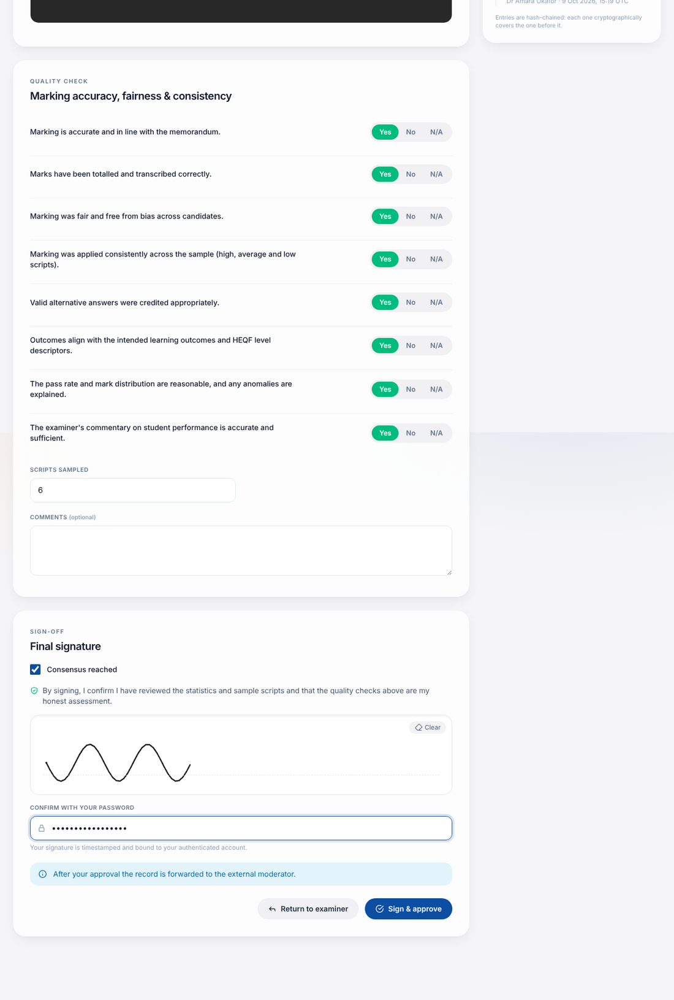
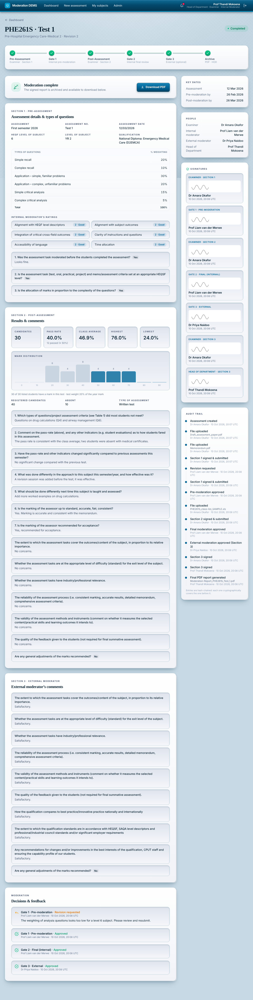

# External moderator manual

You are optional, final reviewer for assessments where your name was added. You **see a record only after the internal moderator has signed off at Gate 2**; before that it does not appear for you.

## Your task (Gate 3)

1. Open the card marked **Your turn** (or follow the e-mail / bell notification).
2. **Read the results** — statistics and the Section 1 and 2 answers.
3. **Read the internal moderator's sign-off**, shown above the evidence (comments and scripts sampled).
4. **Review the evidence** — sample scripts, assessment paper and memorandum, in the built-in viewer.
5. **Complete Section 3** of the official form: comment on coverage, difficulty, relevance, reliability, validity, feedback, best practice, standards and recommendations, and state any general adjustment of marks.
6. Tick **Consensus reached**, sign (drawing + password) and click **Sign & approve**.

On approval the record moves to **Pending Section 3 Sign-off**: the examiner and the Head of Department sign Section 3, and then the PDF report is generated and archived and the record becomes **Completed**.

## If you have concerns

Click **Return to examiner**, explain what needs to change and send. The record goes back to the examiner; after correction, it passes the internal moderator again before reaching you.

## After completion

You can download the signed PDF at any time from the record. It reproduces the official form, with both moderators' sections and all signatures.

## Good to know

- You cannot see the raw marks workbook, only the statistics and scripts.
- Your actions and the documents you open are recorded in the audit trail.
- You cannot create assessments or act on records assigned to other external moderators.
