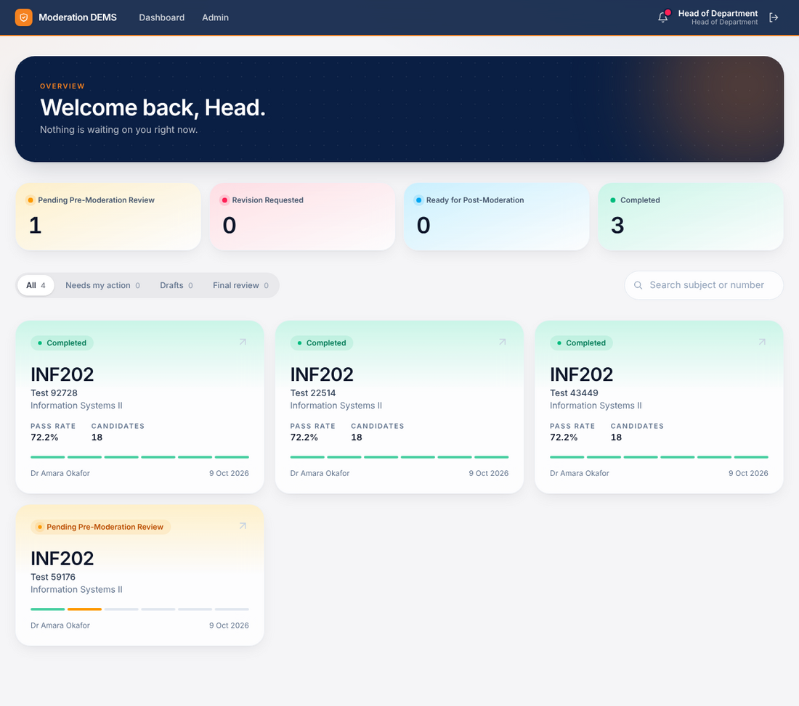
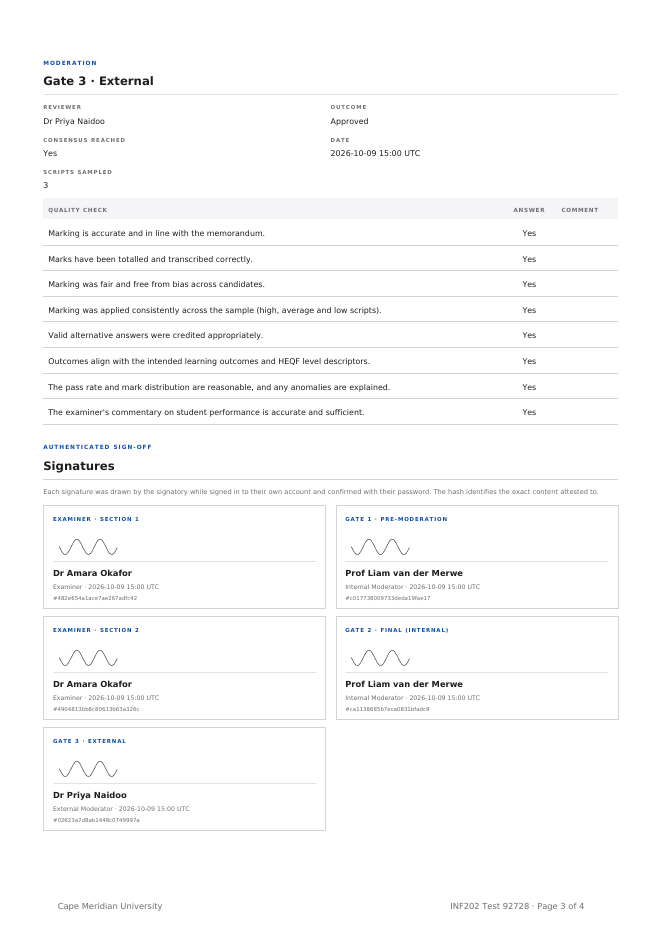
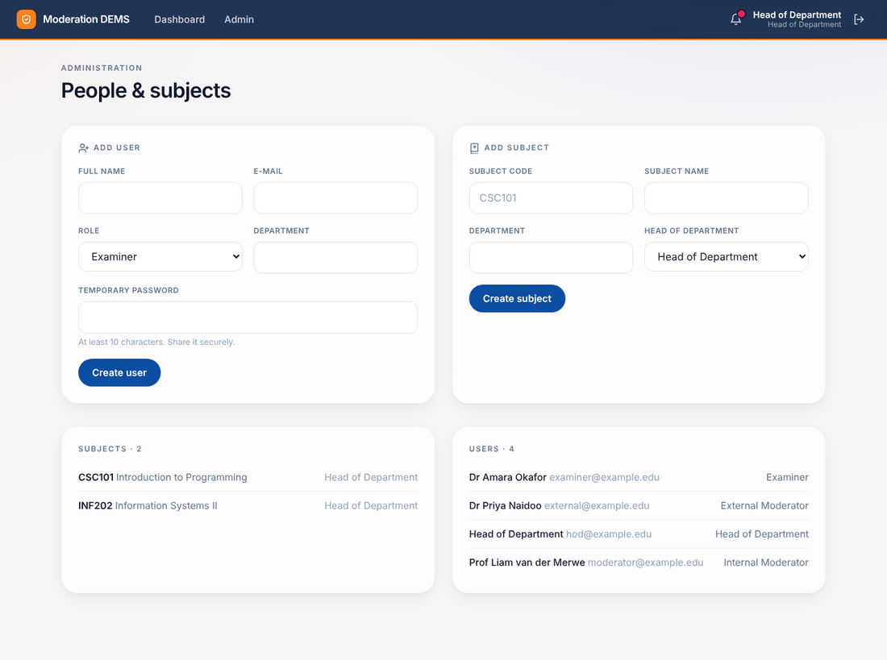

# Head of Department & administrator manual

The HOD role has two jobs: **monitor** moderation across the subjects they head, and **administer** users and subjects.

## Monitor

- The dashboard lists **every record in your subjects**, whatever its status. Use the tiles, tabs and search to see what is pending, returned or completed.
- Open any record to see its progress, collected signatures and audit trail.
- You do **not** sign anything; you receive the result.

### The final report

When a record is **Completed** you get a notification and can download the signed PDF from the record page.

If the server is connected to a mail service, the PDF is also e-mailed to you. The report contains: question types, document fingerprints, performance statistics with chart, examiner commentary, each gate's quality checks and decision, every signature, and the audit-chain reference.

See the whole [sample report](../sample-report.pdf).

## Administer

Open **Admin** in the header.

### Add a user
1. Enter name, e-mail, **role** (Examiner, Internal Moderator, External Moderator, Head of Department) and optional department.
2. Set a **temporary password** (at least 10 characters) and share it securely.
3. Click **Create user**.

### Add a subject
1. Enter the **subject code** (e.g. `CSC101`), name, optional department and the **Head of Department** responsible.
2. Click **Create subject**.

> Examiners can only start assessments for subjects that exist, so create subjects first. At least one internal moderator must exist before an examiner can create an assessment.

### Suggested setup order
1. Add subjects.
2. Add examiners and internal moderators (and external moderators if used).
3. Ask examiners to sign in and start their assessments.

## Responsibilities for production use

- Turn **demo data off** (`DEMS_DEMO_DATA` unset) so the login page does not list accounts.
- Use unique, strong passwords; there is no self-service reset yet, so an administrator sets them.
- Configure e-mail (SMTP) if reports must reach the HOD's inbox — see the [deployment guide](../deployment.md).
- Student marks are stored only as anonymous numbers; do not put names or student numbers in the manual-entry box.
