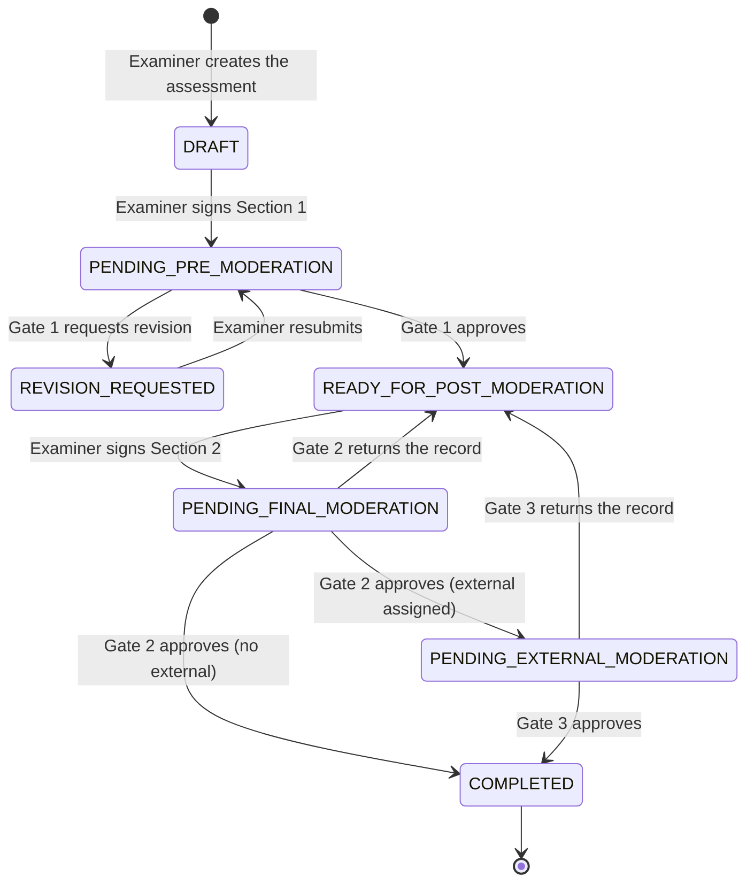
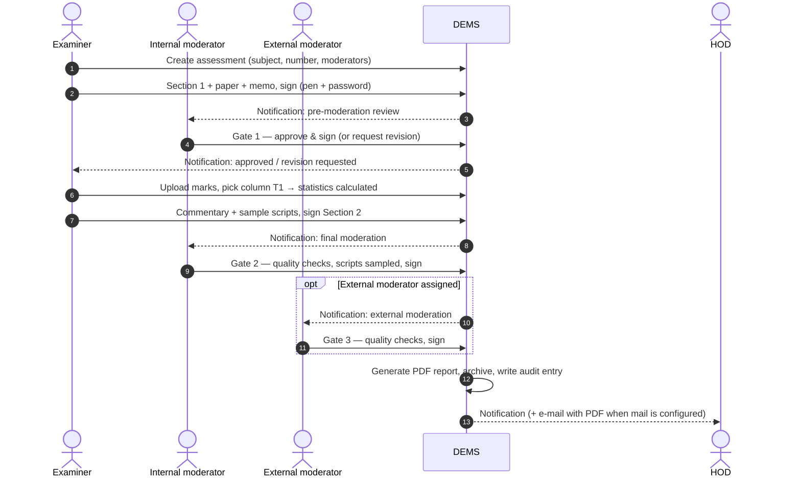

# Workflow reference

How a record moves through Moderation DEMS, who can act at each step, and what the system records.

## Journey at a glance

| Step | Who | What happens | Status afterwards |
|---|---|---|---|
| **Create** | Examiner | Picks subject, assessment number, internal moderator, optional external moderator | `Draft` |
| **Phase 1 — Section 1** | Examiner | Fills the *Types of questions* table (weighting + HEQF level + alignment), uploads paper and memorandum, signs | `Pending Pre-Moderation Review` |
| **Gate 1** | Internal moderator | Reviews documents in the built-in viewer, then **approves** (consensus + signature) or **requests revision** (feedback) | `Ready for Post-Moderation` / `Revision Requested` |
| **Phase 3 — Section 2** | Examiner | Uploads marks (or types them), the engine calculates statistics, adds commentary and optional sample scripts, signs | `Pending Final Moderation Review` |
| **Gate 2** | Internal moderator | Reviews statistics, commentary, scripts; answers the quality checks; signs, or returns the record | `Completed` or `Pending External Moderation` |
| **Gate 3** (optional) | External moderator | Same review, final signature | `Completed` |
| **Phase 5 — Completion** | System | Generates the PDF report, archives it, notifies everyone (and e-mails the HOD when mail is configured) | `Completed` |

## State machine

Rules that are enforced by the server (not just hidden in the UI):

- Only the **assigned** person can act at a step; everyone else gets *403* (or *404* if they may not even see the record).
- Each transition **locks the record** (`SELECT … FOR UPDATE`), so a double click or two people acting at once cannot advance it twice.
- A **returned** record (Gate 2/3) goes back to the examiner; sign-offs then restart from Gate 2. Only the *latest* signature per section appears in the report; earlier ones stay in the audit trail.
- **Completed is final**: nothing can be changed afterwards.

## Sequence of a full lifecycle

## Who can do what

| Action | Examiner | Internal moderator | External moderator | HOD |
|---|:--:|:--:|:--:|:--:|
| Create an assessment | ✅ (own) | – | – | – |
| Edit Section 1, upload paper / memo | ✅ (own, `Draft` / `Revision Requested`) | – | – | – |
| Gate 1 decision | – | ✅ (assigned) | – | – |
| Upload marks / scripts, sign Section 2 | ✅ (own, `Ready for Post-Moderation`) | – | – | – |
| Gate 2 decision | – | ✅ (assigned) | – | – |
| Gate 3 decision | – | – | ✅ (assigned, only once it reaches them) | – |
| View a record | own | assigned | only from `Pending External Moderation` | every record in their subjects |
| Download the signed PDF | ✅ | ✅ | ✅ | ✅ |
| Download the raw marks workbook | ✅ (own) | ❌ | ❌ | ❌ |
| Manage users and subjects | – | – | – | ✅ |

## What the system calculates

Implemented in `app/Services/StatisticsCalculator.php` and unit-tested.

| Result | Rule |
|---|---|
| Candidates | Count of **non-blank, numeric** rows in the chosen column |
| Pass rate | Percentage of candidates with **≥ 50 %** of the total marks |
| Highest / lowest | Best / worst mark as % of total |
| Class average | Mean mark as % of total |
| Excluded entries | Non-numeric text (e.g. `ABS`), negatives and marks above the total are **not** counted and are reported on screen and in the PDF |

The browser only *previews* the numbers. When the examiner signs, the server **recomputes** everything from the uploaded source — client-supplied statistics are never trusted.

## Signatures and audit

- **Signature = pen drawing + password re-entry.** The password check proves the account holder is the one signing.
- Each signature stores a **SHA-256 hash of the exact content attested to** (e.g. Section 1 rows + document fingerprints), a UTC timestamp, IP address and browser.
- The **audit trail** is append-only and **hash-chained** per record: every entry's hash covers the previous one, so an edited or deleted entry breaks the chain. The PDF prints the chain head.
- Uploaded files are fingerprinted (SHA-256) and the fingerprints are listed in the PDF.

The full sample is in [`sample-report.pdf`](sample-report.pdf).

## Notifications

In-app (bell icon) for every hand-over. E-mail is optional: it is sent only when a real mail transport is configured; otherwise the PDF is simply available to download from the record.

## Records created per step

| Table | Content |
|---|---|
| `assessments` | Status, Section 1 rows, Section 2 statistics, commentary (raw scores are stored only as anonymous numbers) |
| `moderation_records` | Each gate decision, comments, quality-check answers, scripts sampled |
| `signatures` | Image, content hash, signer, IP, time |
| `attachments` / `file_blobs` | Paper, memo, marks, scripts, final PDF |
| `audit_logs` | Hash-chained event log |
| `notifications` | In-app messages |
